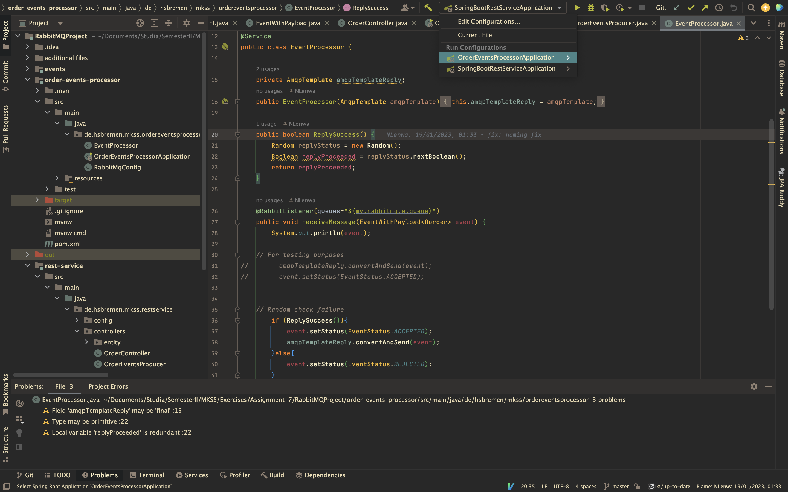

# Order Service REST API with OpenAPI Docs

## Getting started

Download our project from the previous assignment and launch it with IntelliJ IDEA.

Start RabbitMQ as docker container:

```sh
docker run -it --rm --name rabbitmq -p 5672:5672 -p 15672:15672 rabbitmq:3.11-management
```

Launch both of services:

1. Order Service (REST Service) -> on port 8090
2. Order Events Processor (Receiver of RabbitMQ messages) -> on port 8070



Launch our OpenAPI documentation with SwaggerUI.

If it's not present, generate it:
```
openapi-generator generate -g spring -i openapi.yaml -c conf.json -o order-service 
```

Run the service. It will start on port 8080
```sh
mvn package spring-boot:run
```

## Additional Notes

OpenAPI generator didn't allow for identical paths for our REST service (ex. /order/{id} differented with PUT or DELETE).
Thus for OpenAPI docs as temporary solution suffix was added with "/delete" as the previous project has already been delievered to our client.
